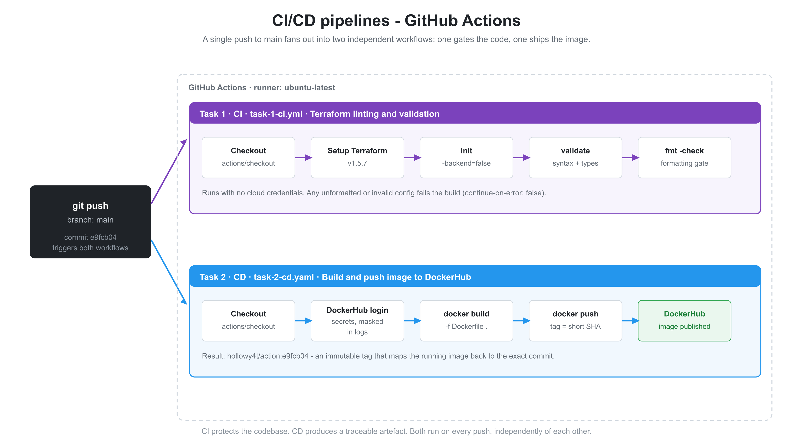

# CI/CD with GitHub Actions

CI/CD module of my DevOps learning path: two GitHub Actions pipelines, plus the
debugging notes from getting them green.

- **CI** - Terraform `init` / `validate` / `fmt -check` on every push to `main`
- **CD** - Docker image build and push to DockerHub, tagged with the commit SHA



## Full documentation

**[cicd/README.md](./cicd/README.md)** - what was built, the pipeline YAML, the
four failures I debugged with root cause and fix, and what I would improve next.

| | |
|---|---|
| [Task 1 - CI](./cicd/task-1) | Terraform linting and validation |
| [Task 2 - CD](./cicd/task-2) | Docker build and push to DockerHub |
| [Workflows](./.github/workflows) | the pipeline definitions |
| [Diagrams](./cicd/diagrams) | pipeline and troubleshooting diagrams |

## Repository layout

```
.github/workflows/    task-1-ci.yml, task-2-cd.yaml
cicd/                 documentation, Terraform config, diagrams, notes
practice/             module practice work, kept separate from the two tasks
app.py, Dockerfile    the application and its image definition
```

## Highlights

- Images are tagged `hollowy4t/action:<short-sha>` so every build traces back to
  the commit that produced it, making rollback a real option.
- CI validates Terraform without cloud credentials via
  `terraform init -backend=false`.
- Registry credentials come from repository secrets and are masked in logs.
- Four real pipeline failures documented with root cause and fix: an invalid
  Docker tag, a stdlib package in `requirements.txt`, a Python import-path
  break, and YAML coercing `3.10` into `3.1`.
