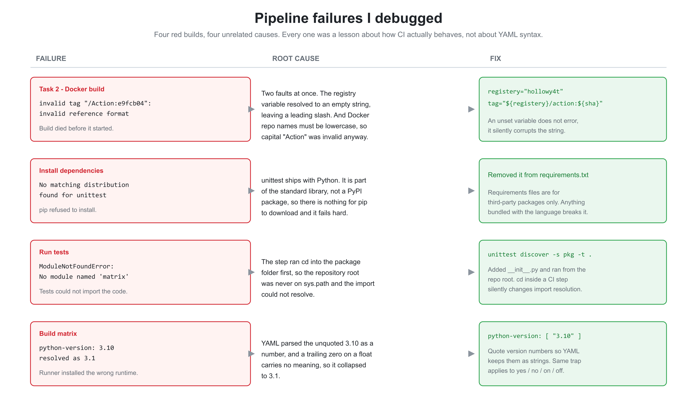

# CI/CD Module - GitHub Actions

Two pipelines built with GitHub Actions: a **CI** workflow that lints and validates infrastructure code on every push, and a **CD** workflow that builds a Docker image and publishes it to DockerHub tagged with the commit SHA.

The interesting part of this module was not writing the YAML. It was debugging why it failed, four separate times, for four completely unrelated reasons. Those are all documented below.

---

## Pipeline overview


A single push to `main` fans out into two independent workflows. CI protects the codebase; CD produces a traceable artefact. Neither depends on the other.

---

## Repository layout

```
Action/
  .github/workflows/
    task-1-ci.yml        CI: Terraform fmt / init / validate
    task-2-cd.yaml       CD: Docker build + push to DockerHub
  cicd/
    task-1/              Terraform config the CI job validates
    task-2/              CD documentation
    diagrams/            architecture and troubleshooting diagrams
    notes/               YAML syntax learning notes
    README.md            this file
  practice/              module practice work (not part of the two tasks)
  app.py, Dockerfile     the application and its image definition
```

---

## Task 1 - Continuous Integration

**File:** [`.github/workflows/task-1-ci.yml`](../.github/workflows/task-1-ci.yml)

Runs Terraform quality gates against [`cicd/task-1`](./task-1) on every push to `main`.

```yaml
name: CI - Terraform Linting and Validation

on:
  push:
    branches: [ main ]

jobs:
  terraform:
    name: Terraform Linting and Validation
    runs-on: ubuntu-latest
    defaults:
      run:
        working-directory: ./cicd/task-1

    steps:
      - name: Checkout code
        uses: actions/checkout@v2

      - name: Set up Terraform
        uses: hashicorp/setup-terraform@v1
        with:
          terraform_version: 1.5.7

      - name: Terraform Init
        run: terraform init -backend=false

      - name: Terraform Validate
        id: validate
        run: terraform validate

      - name: Terraform Format Check
        run: terraform fmt -check
        continue-on-error: false
```

| Gate | Purpose |
|------|---------|
| `terraform init -backend=false` | Initialise without touching remote state, so CI never needs cloud credentials |
| `terraform validate` | Catch syntax and type errors before they reach a plan |
| `terraform fmt -check` | Fail the build on unformatted code, keeping diffs clean |

`continue-on-error: false` is set explicitly on the format check: formatting drift **fails** the pipeline rather than being a warning.

---

## Task 2 - Continuous Deployment

**File:** [`.github/workflows/task-2-cd.yaml`](../.github/workflows/task-2-cd.yaml)

Builds the image and publishes it to DockerHub on every push, tagged with the short commit SHA so every image traces back to the exact commit that produced it.

```yaml
name: Y4t CI/CD workflow automating image push to dockerhub
on: [push]
jobs:
  build:
    runs-on: ubuntu-latest
    permissions:
      contents: read
      id-token: write
    steps:
      - name: Checkout code
        uses: actions/checkout@v2

      - name: Log in to DockerHub
        uses: docker/login-action@v2
        with:
          username: ${{ secrets.DOCKER_USERNAME }}
          password: ${{ secrets.DOCKER_PASSWORD }}

      - name: Build and push Docker image
        run: |
          registery="hollowy4t"
          sha=$(git rev-parse --short HEAD)
          primary_tag="${registery}/action:${sha}"
          docker build -t $primary_tag -f Dockerfile .
          docker push $primary_tag
```

Design decisions worth calling out:

- **SHA tagging over `latest`.** `hollowy4t/action:e9fcb04` says exactly which commit is running. `latest` is a moving target: two people pulling it an hour apart can get different code, and it cannot be rolled back to reliably.
- **Credentials come from repository secrets** (`DOCKER_USERNAME`, `DOCKER_PASSWORD`), never hardcoded. GitHub masks them in logs, which is why run output shows `registry="***"`.
- **Scoped permissions.** `contents: read` follows least privilege instead of inheriting the broader default token.

---

## Issues I hit and how I solved them



### 1. `invalid tag "/Action:e9fcb04": invalid reference format`

The Docker build died before it started. The tag came out as `/Action:e9fcb04` - leading slash, no namespace.

**Cause:** two faults at once. The registry variable resolved to an **empty string**, so `"${registery}/Action:${sha}"` collapsed to `/Action:...`, and a leading slash is not a valid image reference. Separately, Docker repository names **must be lowercase**, so a capital `Action` was invalid regardless.

**Fix:**
```bash
registery="hollowy4t"
primary_tag="${registery}/action:${sha}"
```

**Lesson:** an unset shell variable in a workflow does not raise an error. It silently becomes empty and corrupts whatever string it is interpolated into, so the error surfaces far from the actual mistake.

### 2. `Could not find a version that satisfies the requirement unittest`

`pip install -r requirements.txt` failed with `No matching distribution found for unittest`.

**Cause:** `unittest` is part of the **Python standard library**, not a PyPI package, so there is nothing for pip to download and it fails hard.

**Fix:** removed it from the requirements file.

**Lesson:** requirements files list third-party dependencies only. Anything that ships with the language breaks the install step.

### 3. `ModuleNotFoundError: No module named 'matrix'`

The test step could not import the code under test.

**Cause:** the workflow ran `cd` into the package folder before invoking the tests, which left the **repository root off `sys.path`** so the package could not resolve. There was also no `__init__.py` making it a real package.

**Fix:** added `__init__.py` and ran discovery from the repository root instead of changing into the folder:
```bash
python -m unittest discover -s <pkg> -t .
```
`-s` says where the tests live; `-t` sets the top-level directory placed on `sys.path`.

**Lesson:** `cd` inside a CI step silently changes Python import resolution.

### 4. Build matrix resolved `3.10` as `3.1`

The matrix requested Python `3.10` but the runner installed `3.1`.

**Cause:** YAML parses an unquoted `3.10` as a **number**, and a trailing zero on a float carries no meaning, so it collapsed to `3.1`.

**Fix:**
```yaml
python-version: [ "3.9", "3.10", "3.11" ]
```

**Lesson:** classic YAML type coercion. Quote version numbers, and watch the same trap with unquoted `yes`, `no`, `on`, and `off`.

---

## What I learnt

- **A pipeline is a feedback loop, not a script.** Every failure above was fixed in minutes once the log was read properly. The skill is reading the error, not memorising YAML.
- **Fail fast, fail loud.** `terraform fmt -check` with `continue-on-error: false` blocks formatting drift at the gate instead of letting it rot in the codebase.
- **Tag artefacts with the commit SHA.** Immutable, traceable tags make rollback a real option.
- **Secrets belong in the secret store**, scoped and masked, never in the workflow file.
- **Least privilege applies to CI too.** The default `GITHUB_TOKEN` is broader than most jobs need.
- **Empty variables are more dangerous than missing ones.** An unset variable produced a malformed image tag rather than a clear error.

## Improvements I would make next

1. **Trigger on pull requests.** Both workflows only run on `push`. Adding `pull_request` means checks run *before* code reaches `main`, which is the whole point of CI.
2. **Pin newer action versions.** `actions/checkout@v2` and `hashicorp/setup-terraform@v1` are outdated; `@v4` / `@v3` are current.
3. **Use `docker/build-push-action` with `docker/metadata-action`** for layer caching and automatic tag generation instead of raw `docker build` / `docker push`.
4. **Fix the `registery` typo** and promote it to a workflow-level `env` value.
5. **Harden the Dockerfile** - uncomment the dependency install, move off `python:3.8-slim`, and run as a non-root user.
